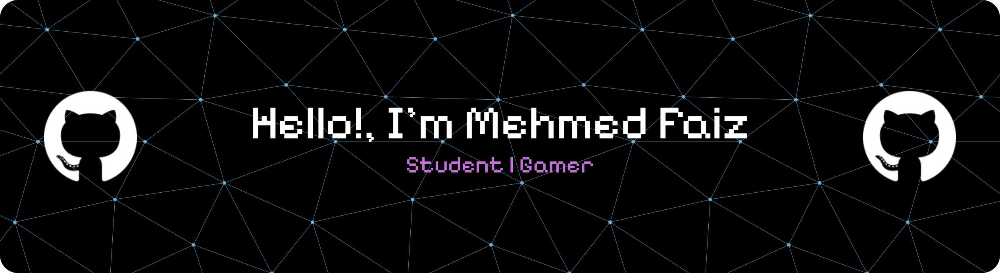

<!-- **MohammadFaiz23/MohammadFaiz23** is a ✨ _special_ ✨ repository because its `README.md` (this file) appears on your GitHub profile. -->

<!-- Here are some ideas to get you started:

- 🔭 I’m currently working on ...
- 🌱 I’m currently learning ...
- 👯 I’m looking to collaborate on ...
- 🤔 I’m looking for help with ...
- 💬 Ask me about ...
- 📫 How to reach me: ...
- 😄 Pronouns: ...
- ⚡ Fun fact: ...

- ⚡ Fun fact: i like playing football
- 🔭 I’m currently study on **Universitas brawijaya**
- 🌱 I’m currently learning java and python
- 📫 How to reach me: [**@meddfaiz**](https://www.instagram.com/meddfaiz_/#)

##### Knowledge

##### Connect with me just click!
 

##### My Github Stats
--> 

## Hello! i'm Muhammad Faiz 👋

## 🌐 Socials:
  

# 💻 Tech Stack:
    
# 📊 GitHub Stats:
 
 

## 🏆 GitHub Trophies

### 🔝 Top Contributed Repo

---

<!-- Proudly created with GPRM ( https://gprm.itsvg.in ) -->